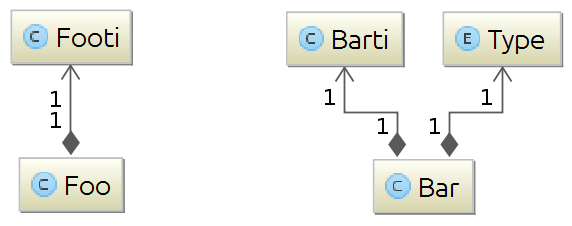

DAMapping Sample project : Maven single module
==============================================

## Project description

The point of this project is to showcase two things:

1. integration of DAMapping into a single module Maven project
2. use of DAMapping with handwritten integration to map a (small) type hierarchy starting with type ```Foo``` to type hierarchy starting with type ```Bar```



### How to build this project

This project requires Maven and Java installed to be compiled and built using the following command line:

```sh
mvn clean install
```

It is best to be run in your favorite IDE:

* import the project from pom.xml file
* run class Demo or unit tests
* read code

### version warning

This project only work with DAMapping 0.4.0+.

## Maven configuration

### With Java 7+

To use DAMapping annotation processing, declaring DAMapping annotation-processor artifact as a direct dependency is enough.
Since Java 7, javac compiler is capable of discovering annotation processor in the class path automatically (aka. here as autodiscovery).

```xml
<dependency>
  <groupId>fr.javatronic.damapping</groupId>
  <artifactId>annotation-processor</artifactId>
  <version>0.3.0</version>
  <!-- note that the compile scope is the default scope so following tag is optionnal -->
  <scope>compile</scope>
</dependency>
```

### With Java 6 or when autodiscovery is disabled

For the following reasons, it might be necessary to explicitly declare DAMApping annotation processor:
* module is compiled with Java 6
* another annotation processor is already declared explicitly in the maven-compiler-plugin
    - declaring explictly annotation processor disables auto discovery
    - so, DAMApping annotation processor has to be declared explicitly as well

```xml
<build>
  <pluginManagement>
    <plugins>
      <plugin>
        <groupId>org.apache.maven.plugins</groupId>
        <artifactId>maven-compiler-plugin</artifactId>
        <configuration>
          <source>1.6</source>
          <target>1.6</target>
          <encoding>UTF-8</encoding>
          <annotationProcessors>
            <annotationProcessor>fr.javatronic.damapping.processor.DAAnnotationProcessor</annotationProcessor>
          </annotationProcessors>
        </configuration>
      </plugin>
    </plugins>
  </pluginManagement>
</build>
```

## Mapping of type hierarchies

### Mapping specifications in this project

Particularities of this mapping are:

* ```Bar``` type is immutable, when ```Foo``` type is not
* ```Foo``` objects are assumed to be produced from an unreliable source that returns a list of ```Foo```:
    * which may contain ```null``` values,
    * ```Foo``` objects with null or invalid field values
    * use ```String``` to represent a restricted set of values
* in consequence, mapping to ```Bar`` type
    * defines several default values
    * rules on how to handle null/empty fields
    * correctly uses an ```Enum``` to represent restricted set of values
* in addition, some imaginary business rule is
    * for each value (```null``` included) of the list returned by the service, there must be a ```Bar``` instance.

### Package structure

```
fr.javatronic.damapping.demo
                          \__ bean : Foo and Bar type hierarchies
                          |
                          \__ mapper : classes annotated with @Mapper
                          |
                          Demo : entry point of this program
```

The ```Demo``` class which simply demonstrate the use of the classes generated by DAMapping to tranform an instance of
```Foo``` into a ```Bar``` object.

### source code highlights

Mapping ot the two-depth hierachies is implemented with two dedicated classes annotated with ```@Mapper```:

* class ```FootiToBarti``` implements the mapping from type ```Footi``` to type ```Barti```
* class ```FooToBar``` implements the mapping from type ```Foo``` to type ```Bar```

Note that class ```FooToBar``` uses ```FootiToBartiMapper`` interface as a dependency, instead of class ```FootiToBarti```

This allows having class ```FooToBar``` to be dependent of an interface instead of a class (which can later be mocked in unit tests, see below).

### Unit tests

Note that the right way to write unit tests in such case of mapping bean hierarchies is to write on unit test for each
class annotated with ```@Mapper```.

As showcased in unit test [FooToBarTest](src/test/java/fr/javatronic/damapping/demo/mapper/FooToBarTest.java), only the
logic specific to the ``FooToBar``` class is tested.

Interface ```FootiToBartiMapper``` is mocked and details of the mapping from ```Footi``` to ```Barti``` are only tested
in the unit test of class ```FootiToBarti``` ([FootiToBartiTest](src/test/java/fr/javatronic/damapping/demo/mapper/FootiToBartiTest.java)).
